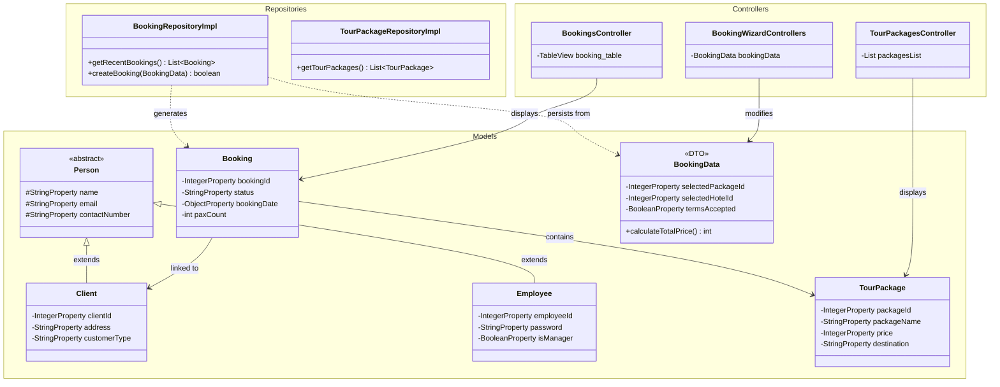

# Travel Management System - UML Diagrams

This document contains the structural representation of the Travel Management System using UML Class Diagrams.

## 1. Core System Architecture (MVC & Repositories)

This diagram shows how the Models, Repositories, Controllers, and View Factories interact.

## 2. Model Usage Breakdown

### Person Hierarchy
- **Person (Abstract):** Base class providing common identity fields (Name, Email, Contact).
- **Client:** Extends Person; represents the customer and includes travel history/address.
- **Employee:** Extends Person; represents staff members with login credentials and roles.

### Booking System
- **Booking:** The persistent record of a finalized transaction. Used in dashboard tables and history views.
- **BookingData (DTO):** A "Data Transfer Object" that exists only during the **Booking Wizard** process. It holds temporary state (selected hotel, vehicle, etc.) before it is converted into a permanent `Booking` and `Client` record in the database.

### Product Catalog
- **TourPackage:** Represents the core travel products. It is used by the User to browse destinations and by the Admin to manage pricing and availability.
